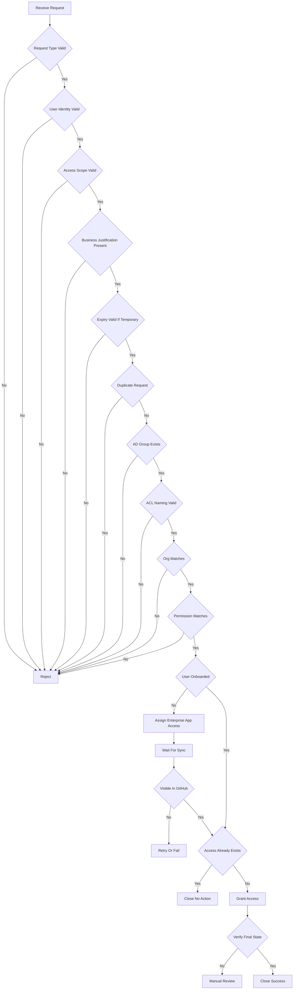

# GitHub Access Automation Flow

```mermaid
flowchart TD
    A[Receive Request] --> B{Request Type Valid}
    B -- No --> X[Reject]
    B -- Yes --> C{User Identity Valid}
    C -- No --> X
    C -- Yes --> D{Access Scope Valid}
    D -- No --> X
    D -- Yes --> E{Business Justification Present}
    E -- No --> X
    E -- Yes --> F{Expiry Valid If Temporary}
    F -- No --> X
    F -- Yes --> G{Duplicate Request}
    G -- Yes --> X
    G -- No --> H{AD Group Exists}
    H -- No --> X
    H -- Yes --> I{ACL Naming Valid}
    I -- No --> X
    I -- Yes --> J{Org Matches}
    J -- No --> X
    J -- Yes --> K{Permission Matches}
    K -- No --> X
    K -- Yes --> L{User Onboarded}
    L -- No --> M[Assign Enterprise App Access]
    M --> N[Wait For Sync]
    N --> O{Visible In GitHub}
    O -- No --> Y[Retry Or Fail]
    O -- Yes --> P{Access Already Exists}
    L -- Yes --> P
    P -- Yes --> Q[Close No Action]
    P -- No --> R[Grant Access]
    R --> S{Verify Final State}
    S -- No --> Z[Manual Review]
    S -- Yes --> T[Close Success]
```
